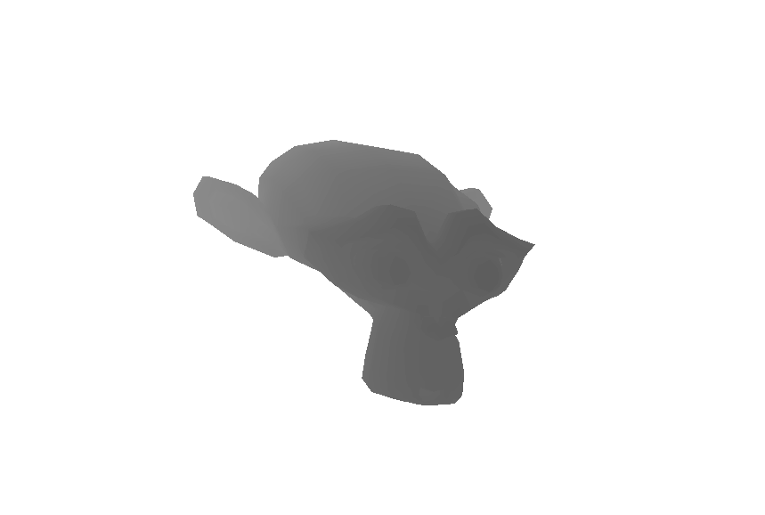

# gpu_compute_rasterizer



This is a basic implementation of a rasterizer using compute shaders and [wgpu](https://github.com/gfx-rs/wgpu).

## Differences

1. Typed GPU buffers.

From the CPU side I was able to utilize Rust type system and awesome crate [bytemuck](https://github.com/Lokathor/bytemuck) to have typed GPU buffers.

WebGPU (and any other graphics API) has strict rules for memory alignment. 
`Vec3` vector types having size of 12 (3 * size_of(f32)) bytes has an alignment of 16, same as `Vec4`. And for Rust, all structs have to be marked as `#[repr(C)]` it prevents from shuffling fields for the sake of size optimization and the alighment checked by `Pod` and `Zeroable` traits provided by `bytemuck`.

2. Render one fullscreen triangle instead of quad.

Having to render a fullscreen quad (or something that fills the whole screen required in `present.wgsl` shader to copy buffer content on screen.

Advantages of using fullscreen triangle is it only requires 3 vertex shader invocations (instead of 6 for a quad made up of two triangles) and less code(but not simpler).

```rust
[[stage(vertex)]]
fn vs_main_trig([[builtin(vertex_index)]] vertex_idx: u32) -> VertexOutput {
  let uv = vec2<u32>((vertex_idx << 1u) & 2u, vertex_idx & 2u);
  let out = VertexOutput(vec4<f32>(1.0 - 2.0 * vec2<f32>(uv), 0.0, 1.0));
  return out;
}
```

3. More types in shaders

I also tried to simplify buffer access by creating `Pixel` struct, but that didn't work well, because we can't currently have atomic operations and types on non `scalar types` by wgsl spec. 

```rust
  let p = color_buffer.value[index];

  let pixel = pixel_to_vec(p);

  let col = vec4<f32>(pixel, 1.0);
```
  
original
```rust
  let index = u32(X + Y * uniforms.screenWidth) * 3u;

  let R = f32(finalColorBuffer.data[index + 0u]) / 255.0;
  let G = f32(finalColorBuffer.data[index + 1u]) / 255.0;
  let B = f32(finalColorBuffer.data[index + 2u]) / 255.0;

  let finalColor = vec4<f32>(R, G, B, 1.0);
```

Also I tried to add look_at camera, but currently didn't get any success in it.
